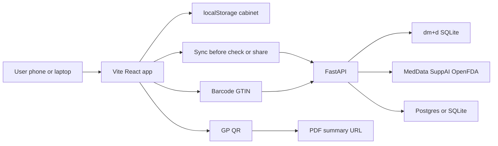

# Pocketary

> Every medicine and supplement, in one pocket.

Pocketary is a personal medicine cabinet you can carry on your phone. Track NHS, private, and over-the-counter medicines in one place, get plain-language signals when combinations might need a professional look, and share a structured summary with your GP when you need to.

## The problem

Many people take a mix of NHS prescriptions, over-the-counter medicines, and online-purchased products (including supplements). Harmful drug–drug and drug–supplement interactions often go unnoticed until a clinician spots them. At appointments, patients and carers also struggle to give GPs an accurate list of what they take now and what they used to take — memory and scattered packaging are unreliable.

## Why we built it

Pocketary was built for the **Juno medication-safety hackathon** (this repo: `juno-hackathon`). The aim is a patient-owned list built from **official NHS dm+d** identifiers on pack barcodes, early **awareness** of possible interactions (not diagnosis), and a **GP handoff** that does not depend on recall.

It is a hackathon demo: no production auth yet, not a medical device, and not for emergency decisions.

## What it does

### Add a medicine

Scan a pack barcode (GTIN) or enter a code manually. The backend resolves the product against **NHS dm+d** (a local database from TRUD or a sample build). You add dosage, times, start date, and category (`nhs_prescription`, `otc`, or `online`). The medicine lives in your cabinet on the device.

### Interaction check

When your cabinet changes (or on demand), active medicines are compared pairwise on the server. Evidence comes from **MedData** (primary), **[Supp.AI](https://supp.ai/)** (supplements and gap-fill), and **OpenFDA** label text where relevant. The app shows a single amber **Potential interaction** label and a read-more view with source excerpts — not severity grades on the surface.

### GP share

Before sharing, the app syncs your cabinet to the backend. You generate a **time-limited** token and QR code that points at a PDF: active medicines (dose, schedule, category, start date), archived medicines (start and end), optional interaction highlights, and disclaimers. A GP or pharmacist scans the QR without relying on the patient's memory.

**Who it's for:** patients and carers managing their own list; GPs and pharmacists who need a quick, structured handoff.

## How it works

| Layer | Role |
|-------|------|
| **React + Vite** | PWA UI (local dev or Vercel); barcode camera via ZXing |
| **FastAPI** | dm+d lookup, medication sync, interaction checks, GP PDFs |
| **`dmd.sqlite`** | Read-only NHS dm+d (TRUD ingest or sample script) |
| **App database** | Supabase Postgres or local `app.sqlite` (cabinet, interactions, GP tokens) |
| **Identity (v1)** | Demo header `X-User-Id` (default `demo`) — API keys stay on the server |



**Dual state:** the UI reads and writes your cabinet in **localStorage** for a fast, offline-friendly demo. Before interaction checks and GP share, the app **syncs** to `POST /medications` so the backend matches what you see. The server does not overwrite the on-device list. See [docs/hosting-and-data.md](docs/hosting-and-data.md).

### Stack

- **Frontend:** Vite + React ([frontend/](frontend/))
- **Backend:** FastAPI ([backend/README.md](backend/README.md))
- **App data:** Supabase Postgres or local SQLite ([docs/hosting-and-data.md](docs/hosting-and-data.md), [supabase/README.md](supabase/README.md))

## Safety and limitations

Every API response and PDF includes: *This information is for awareness only and is not medical advice. Discuss with a pharmacist or GP.*

Interaction surfaces use one amber **Potential interaction** label — no High/Moderate severity on patient-facing screens. US FDA label evidence may not match UK products exactly; the detail view says so. For product tone and UI rules, see [DESIGN.md](DESIGN.md).

## Documentation

- [DESIGN.md](DESIGN.md) — design tokens, look and feel, landing patterns
- [docs/deploy-vercel-phone-scan.md](docs/deploy-vercel-phone-scan.md) — Vercel + phone scanning
- [docs/hosting-and-data.md](docs/hosting-and-data.md) — where each layer runs
- [backend/README.md](backend/README.md) · [frontend/README.md](frontend/README.md) · [supabase/README.md](supabase/README.md)
## Frontend

```bash
cd frontend && cp .env.example .env && npm install && npm run dev
```

Open the app at **http://localhost:5173** (API defaults to **http://localhost:8000** in `frontend/.env`).

Phone / LAN testing for QR scans is optional later — see comments in `frontend/.env.example`.

**Vercel + phone barcode scanning:** [docs/deploy-vercel-phone-scan.md](docs/deploy-vercel-phone-scan.md)

**Hosting choices (Supabase app DB + FastAPI):** [docs/hosting-and-data.md](docs/hosting-and-data.md)

**Vercel deploy:** set `VITE_API_BASE_URL`, `VITE_PUBLIC_PDF_ORIGIN`, and `VITE_USER_ID` in the project env vars, then redeploy — otherwise the built app defaults to `http://localhost:8000` and API calls fail on phones.

Add `MEDDATA_API_KEY` in backend `.env` for faster interaction checks (see [backend/README.md](backend/README.md)).

### Verify API wiring

**Health:**

```text
http://localhost:8000/health
```

Expect `status: ok`, `meddata_configured: true`, `app_db_ok: true`.

**MedData + Supp.AI smoke (laptop, live APIs):**

```bash
cd backend && source .venv/bin/activate
python scripts/smoke_interactions.py
```

**Full interaction check for demo user (after backend is running):**

```bash
curl -s -X POST http://localhost:8000/interactions/check \
  -H 'X-User-Id: demo' -H 'Content-Type: application/json' -d '{}'
```

The app runs interaction checks **only through the Python backend** (`POST /interactions/check`); Home and Interactions share the same results (no client-side demo fallback). The API no longer auto-replaces the demo user's medicines when MedData returns no hits — for a backend-only MedData demo cabinet, run `python scripts/seed_meddata_demo_cabinet.py` from `backend/` (does not change the phone's localStorage).
