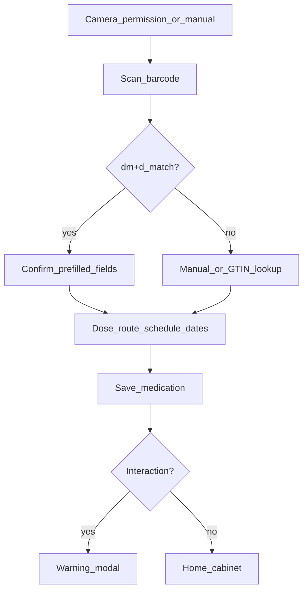

# Mobbin inspirations for Juno

Curated UI/UX references for the medication safety app ([plan.md](../plan.md)). Use Mobbin collections to compare **flows**, not to redesign screens ([frontend/BUILD_CONTRACT.md](../frontend/BUILD_CONTRACT.md)).

## Mobbin entry points

| Hub | URL |
|-----|-----|
| Medical (mobile) | https://mobbin.com/explore/mobile/app-categories/medical |
| Healthcare (mobile) | https://mobbin.com/explore/mobile/app-categories/healthcare-app |
| Camera & Scanner | https://mobbin.com/explore/mobile/screens/camera-scanner |
| Scanning flows | https://mobbin.com/explore/mobile/flows/scanning |
| Medical (web) | https://mobbin.com/explore/web/app-categories/medical |

Suggested collection name on Mobbin: **Juno — cabinet / scan / warnings / share**.

---

## 1. GoodRx (iOS) — medicine list and care home

**Mobbin search:** `GoodRx`

**Screens to open**

| Screen (Mobbin title) | Mobbin tags (useful) |
|-----------------------|----------------------|
| Medicine Cabinet Homepage | Tab Bar, Badge, Card, Home, Searching & Finding, Adding & Creating, Deleting & Removing |
| Care Summary | Carousel, Card, Tab Bar |
| Care Home | Deleting & Removing |
| Personalized Homepage | Card, Tab Bar, Illustration, Carousel, Purchasing & Ordering |
| GoodRx Home | Progress, Wallet & Balance, Goal & Task, Promotions & Rewards |

**Patterns worth copying (conceptually)**

- **Segmented “care” home:** Summary content above a scannable med list — compare to Juno’s NHS / Private / OTC segment on [Home.tsx](../frontend/src/screens/home/Home.tsx).
- **Card density:** Name + secondary line + trailing action without feeling like a clinical chart — aligns with [MedCard.tsx](../frontend/src/components/MedCard.tsx) (name, brand, dose/schedule, warning badge).
- **Empty and sparse lists:** GoodRx uses progress indicators and goals when the cabinet is light; Juno should keep strong empty states per category tab.
- **Tone:** Commerce-adjacent but clear; useful reference for non-alarmist copy while keeping GP disclaimers.

**Juno routes:** `/home`, `/archive`, `/share` (doc preview before QR).

**Gap vs Juno today:** GoodRx emphasizes savings/offers; ignore promo chrome. Focus on list hierarchy and tab bar placement relative to “medication list” label.

---

## 2. Lifesum (iOS) — barcode scanner

**Mobbin path:** Camera & Scanner → filter **Lifesum** → **Barcode Scanner** (tagged *Adding & Creating*).

**Related references on same page**

- **Amazon Shopping** — Barcode Scanner (retail scan → product).
- **Walmart** — Scanner Screen (retail).
- **Camera Access Request** — permission primer (generic pattern; compare to Juno camera gate).

**Patterns worth copying**

| Stage | Lifesum / category norm | Juno implementation ([Add.tsx](../frontend/src/screens/add/Add.tsx)) |
|-------|-------------------------|----------------------------------------------------------------------|
| Permission | Dedicated request / rationale | `add-camreq` + “Request camera access” before `mode === 'scan'` |
| Active scan | Full-screen camera, viewfinder | Dark `add-scan`, reticle, `add-scan-hint` |
| Processing | Loading on scan result | `scanLine1`–`3`: Scanning → Looking up → Match found |
| Success | Pre-filled create form | `mode === 'filled'` + green banner “Filled automatically from barcode scan” |
| Failure | Manual fallback | `lookupErr` + switch to Manual tab / GTIN lookup row |

**Micro-UX checklist from Mobbin scanner category**

- [ ] Torch control wired (UI exists on scan header; ensure it toggles `track.enabled` when implementing).
- [ ] Haptic or subtle success animation on dm+d match (optional polish).
- [ ] Keep three-line status block (`mt1`/`mt2`/`mt3`) — matches “product name + subtitle + source” pattern in food/logging apps.

**Juno routes:** `/add`, `/add?state=scan|filled|camera`.

---

## 3. Apple Health (iOS) — trust, hierarchy, warnings

**Mobbin search:** `Apple Health` (Medical / Healthcare categories).

**Screens to open**

- **Home** — Top Navigation Bar, Tab Bar, Searching & Finding.
- **Health Summary** — summary-first layout.
- **HealthKit Connection** — “connected data” status (parallel: “connected to NHS” on Home header).
- **Activity and Medication Log** — Logging & Tracking (med + activity pairing).
- **Well-guide** — educational content framing.
- **Coach Marks / Guided Tour** — onboarding without clutter.

**Patterns for interaction and safety UI**

Apply to [Warning.tsx](../frontend/src/screens/warning/Warning.tsx), [ReadMore.tsx](../frontend/src/screens/readmore/ReadMore.tsx), [Interactions.tsx](../frontend/src/screens/interactions/Interactions.tsx):

1. **Primary fact first** — one headline (“Potential interaction”), short subcopy.
2. **Structured pair display** — Apple uses grouped rows; Juno already uses `warn-pill` pair + swap icon — keep vertical rhythm generous (Apple-style whitespace).
3. **Secondary evidence** — `warn-reason` ≈ detail row; Read more ≈ drill-down sections (source card, affected systems).
4. **Action ladder** — primary “Review interaction”, secondary ghost “Add anyway”; mirror Apple’s destructive vs default button weighting.
5. **Source attribution** — `GpNote` + database glyph on Read more ≈ Health’s data provenance rows.

**Do not copy:** Severity color scales Apple uses for fitness metrics; Juno stays **single amber**, no High/Moderate grades (legal).

**Juno routes:** `/interactions`, `/interactions/:id`, warning modal on save from Add.

---

## 4. Hims (iOS + web) — current medications intake

**Mobbin mobile:** `Hims` in Medical — Order Approved, onboarding cards, treatment flows.

**Mobbin web (strong for med lists):** Medical web → Hims:

| Screen | Relevance |
|--------|-----------|
| **Current Medications Question** | Multi-select / list of what user takes now |
| **No Medications Selected** | Empty validation state |
| **Options Modal** / **Dialog** | Pick from list without leaving flow |
| **Assessment … Cardiovascular** etc. | Step progress + single-focus questions |
| **Reviewing Responses** | Summary before commit |

**Patterns worth copying**

- **Chip/list onboarding meds** — compare to [Onboarding.tsx](../frontend/src/screens/onboarding/Onboarding.tsx) (`meds` array, add/remove).
- **Explicit empty state** when no meds selected — before allowing “continue”.
- **Manual path when scan fails** — web quiz pattern: text fields + validation messages ([Add.tsx](../frontend/src/screens/add/Add.tsx) manual tab, GTIN lookup).
- **Progress indicator** on multi-step intake — Juno onboarding “Step 1 of 2” + progress bar already aligned; Hims shows heavier step summaries worth referencing if you add a “review cabinet” step.

**Juno routes:** `/onboarding`, `/add` (manual), `/archive`.

---

## 5. Walmart (iOS) — end-to-end scanning and prescription detail

**Mobbin flows:** [Scanning flows](https://mobbin.com/explore/mobile/flows/scanning)

| Flow name | Steps (Mobbin description) | Juno mapping |
|-----------|----------------------------|--------------|
| **Searching Walmart using scanner** | Scan product → **product details page** | Scan → dm+d lookup → filled Add form |
| **Adding prescription detail** | Upload photo **or** manual entry → confirmation → add to cart | Camera/manual Add → dose, schedule, dates → Save → Home |

**Cross-reference: Bird flow “Scanning a card”**

- Camera permission → scan to pre-fill → **manual entry fallback** — same branching as Juno scan / manual / GTIN.

**End-to-end journey to mirror**

**Prescription-detail flow ideas (metadata, not layout changes)**

- Walmart separates **capture** (photo/upload) from **structured fields** — Juno already separates scan (`mode === 'scan'`) from form (`filled`/`manual`).
- Confirmation screen before destructive/cart action — Juno uses **Warning** modal before persisting conflicting meds; optional future: confirm sheet before GP share if interactions exist ([Share.tsx](../frontend/src/screens/share/Share.tsx)).

**Juno routes:** `/add`, `/home`, `/share`.

---

## 30-minute review order

| # | App | Mobbin focus | Juno file touchpoints |
|---|-----|--------------|------------------------|
| 1 | GoodRx | Medicine Cabinet Homepage | `Home.tsx`, `MedCard.tsx` |
| 2 | Lifesum | Barcode Scanner | `Add.tsx` scan + filled states |
| 3 | Apple Health | Health Summary, drill-downs | `Warning.tsx`, `ReadMore.tsx` |
| 4 | Hims | Current Medications Question (web) | `Onboarding.tsx`, Add manual |
| 5 | Walmart | Adding prescription detail (flow) | Full add journey + Share prep |

---

## Skip for this project

- **Zocdoc** — booking/doctor search unless you add appointments.
- **Trust Wallet / Rainbow** — QR-only patterns; not med-specific.
- **Google Fit** — general logging; lower priority than GoodRx/Hims for polypharmacy.

---

## Optional polish backlog (inspired by Mobbin, not in BUILD_CONTRACT)

These are **ideas only** — do not implement without explicit product sign-off:

1. GoodRx-style **badge count** on segment tabs (already have `count` spans on Home).
2. Lifesum-style **scan success** animation before switching to `filled`.
3. Apple Health-style **source row** on interaction list items (MedData / Supp.AI).
4. Hims-style **“no medications yet”** illustration on empty Home tab.
5. Walmart-style **single confirmation** step listing all fields before first GP share.
